# semantic-ait-course-recommender


This project is done in fulfillment of the course Semantic Web Technology in Asian Institute of Technology. 

Goal: The goal is to recommend courses to students based on tags added to the courses. 

Note: All instances, classes and objects are missing here. This is a proof of concept.

1. First we modeled the class structure for our project. 

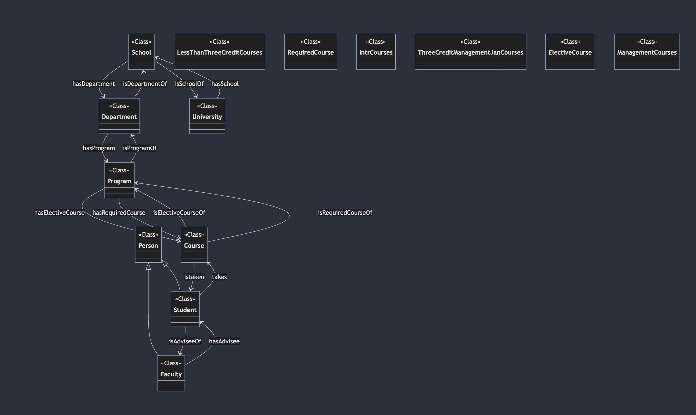


2. The object properties are as follows:

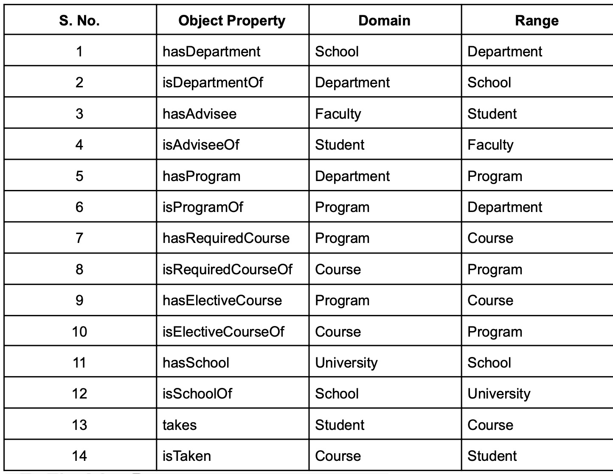

3. The data properties are as follows:

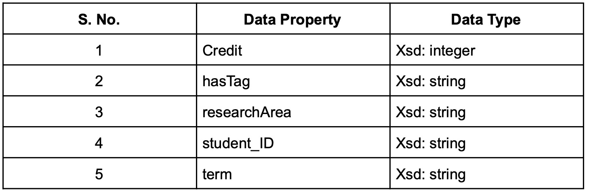

4. The instance count and instance type matrix are as follows:

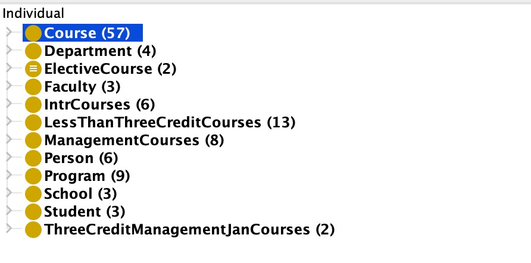

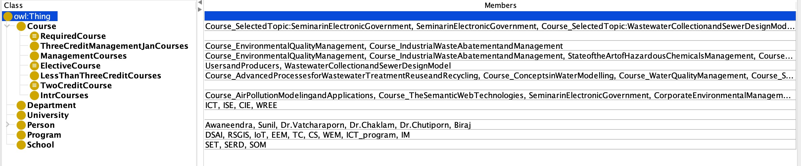


# Steps to run :

1. As of 9 July, 2024 you can use [this website](https://atomgraph.github.io/SPARQL-Playground/) to test the query. 
2. Load the <code>ait.rdf</code> file to the RDF input. Set type as <b>RDF/XML</b>.
3. Copy each query and add to SPARQL Query editor.
4. Execute.

# The Competency Questions


<b>List all the course name, term, credit and program in AIT</b>


```
PREFIX rdf: <http://www.w3.org/1999/02/22-rdf-syntax-ns#>
PREFIX rdfs: <http://www.w3.org/2000/01/rdf-schema#>
PREFIX ns: <http://www.semanticweb.org/biraj/ontologies/2024/6/untitled-ontology-33#>

SELECT ?courseName ?term (STR(?credit) AS ?creditStr) ?program
WHERE {
  ?course rdf:type ns:Course .
  ?course rdfs:comment ?courseName .
  ?course ns:term ?term .
  ?course ns:credit ?credit .
  ?course (ns:isRequiredCourseOf|ns:isElectiveCourseOf) ?program .
}
ORDER BY ?term ?credit ?courseName
```


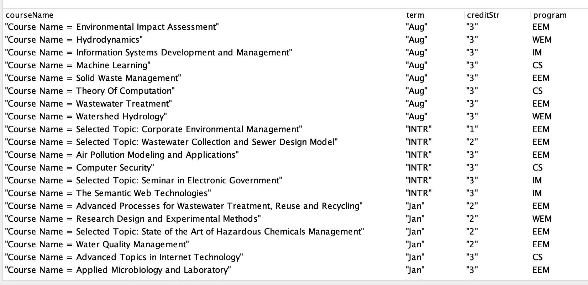


--- 

<b>Each course has a ‘tag’ associated with them. Get all tags for each course.</b>

```
PREFIX rdf: <http://www.w3.org/1999/02/22-rdf-syntax-ns#>
PREFIX rdfs: <http://www.w3.org/2000/01/rdf-schema#>
PREFIX ns: <http://www.semanticweb.org/biraj/ontologies/2024/6/untitled-ontology-33#>

SELECT ?tag (STR(COUNT(?course)) AS ?numberOfCourses)
WHERE {
  ?course rdf:type ns:Course .
  ?course ns:hasTag ?tag .
}
GROUP BY ?tag
ORDER BY DESC(?numberOfCourses)

```

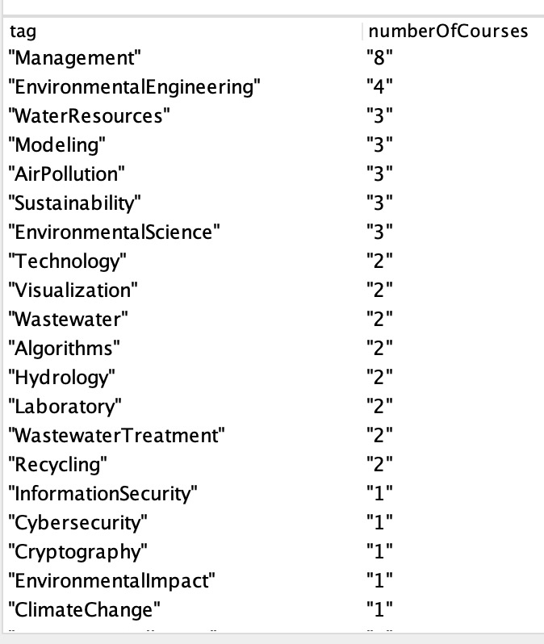


--- 

<b>For each of the tag, display the associated subjects.</b>

```
PREFIX rdf: <http://www.w3.org/1999/02/22-rdf-syntax-ns#>
PREFIX rdfs: <http://www.w3.org/2000/01/rdf-schema#>
PREFIX ns: <http://www.semanticweb.org/biraj/ontologies/2024/6/untitled-ontology-33#>

SELECT ?tag (STR(COUNT(?course)) AS ?numberOfCoursesStr) (GROUP_CONCAT(?courseName; separator=", ") AS ?courses)
WHERE {
  ?course rdf:type ns:Course .
  ?course ns:hasTag ?tag .
  ?course rdfs:comment ?courseName .
}
GROUP BY ?tag
ORDER BY DESC(COUNT(?course))

```

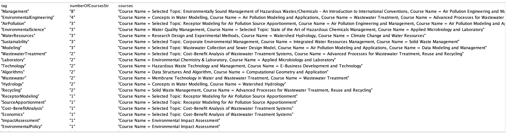


--- 

<b>Sunil just finished his August semester. He wants to take a course that is related to “environment” this January semester.</b>

```
PREFIX rdf: <http://www.w3.org/1999/02/22-rdf-syntax-ns#>
PREFIX rdfs: <http://www.w3.org/2000/01/rdf-schema#>
PREFIX ns: <http://www.semanticweb.org/biraj/ontologies/2024/6/untitled-ontology-33#>

SELECT ?course ?program ?term ?creditStr (GROUP_CONCAT(DISTINCT ?allTags; separator=", ") AS ?tags)
WHERE {
  ?course rdf:type ns:Course .
  ?course ns:term ?term .
  ?course (ns:isRequiredCourseOf|ns:isElectiveCourseOf) ?program .
  ?course ns:credit ?credit .
  ?course ns:hasTag ?tag .
  FILTER (?term = "Jan" && REGEX(STR(?tag), "environment", "i"))
  ?course ns:hasTag ?allTags .
  BIND(STR(?credit) AS ?creditStr)
}
GROUP BY ?course ?program ?term ?creditStr

```

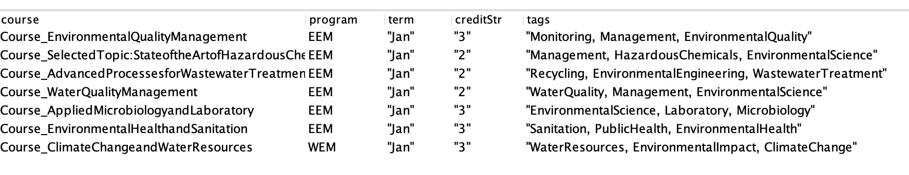


--- 

<b> List all student and advisor list </b>

```
PREFIX rdf: <http://www.w3.org/1999/02/22-rdf-syntax-ns#>
PREFIX rdfs: <http://www.w3.org/2000/01/rdf-schema#>
PREFIX ns: <http://www.semanticweb.org/biraj/ontologies/2024/6/untitled-ontology-33#>

SELECT ?student ?faculty
WHERE {
  ?student rdf:type ns:Student .
  ?student ns:isAdviseeOf ?faculty .
}

```

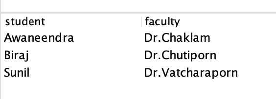


--- 

<b>Awaneendra wants to see all the tags for the courses in all of the programs.</b>

```
PREFIX rdf: <http://www.w3.org/1999/02/22-rdf-syntax-ns#>
PREFIX rdfs: <http://www.w3.org/2000/01/rdf-schema#>
PREFIX ns: <http://www.semanticweb.org/biraj/ontologies/2024/6/untitled-ontology-33#>

SELECT ?program (STR(COUNT(DISTINCT ?tag)) AS ?uniqueTagCountStr) (GROUP_CONCAT(DISTINCT ?tag; separator=", ") AS ?uniqueTags)
WHERE {
  ?course rdf:type ns:Course .
  ?course (ns:isRequiredCourseOf|ns:isElectiveCourseOf) ?program .
  ?course ns:hasTag ?tag .
}
GROUP BY ?program
ORDER BY ?program

```

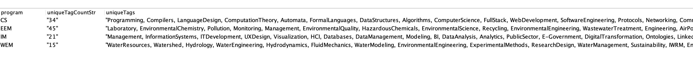


--- 

<b>Binit considers taking a  management course sometime in the future. He wants to see all available courses related to “management” and when they are available. </b>

```
PREFIX rdf: <http://www.w3.org/1999/02/22-rdf-syntax-ns#>
PREFIX rdfs: <http://www.w3.org/2000/01/rdf-schema#>
PREFIX ns: <http://www.semanticweb.org/biraj/ontologies/2024/6/untitled-ontology-33#>

SELECT ?term ?program (STR(COUNT(?course)) AS ?courseCountStr) (GROUP_CONCAT(DISTINCT ?courseName; separator=", ") AS ?courseNames)
WHERE {
  ?course rdf:type ns:Course .
  ?course ns:term ?term .
  ?course (ns:isRequiredCourseOf|ns:isElectiveCourseOf) ?program .
  ?course ns:hasTag ?tag .
  ?course rdfs:comment ?courseName .
  FILTER (?term IN ("Jan", "Aug", "INTR") && REGEX(STR(?tag), "management", "i"))
}
GROUP BY ?term ?program
ORDER BY ?term ?program

```

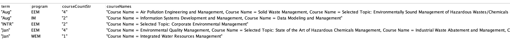


--- 

<b> CS batch 2024 recently completed two semesters.Now it's time for inter-sem. The students are exhausted and wish to take courses that have less credit.</b>

```
PREFIX rdf: <http://www.w3.org/1999/02/22-rdf-syntax-ns#>
PREFIX rdfs: <http://www.w3.org/2000/01/rdf-schema#>
PREFIX ns: <http://www.semanticweb.org/biraj/ontologies/2024/6/untitled-ontology-33#>

SELECT ?courseName ?term (STR(?credit) AS ?creditStr) (GROUP_CONCAT(DISTINCT ?tag; separator=", ") AS ?tags)
WHERE {
  ?course rdf:type ns:Course .
  ?course rdfs:comment ?courseName .
  ?course ns:term ?term .
  ?course ns:credit ?credit .
  ?course ns:hasTag ?tag .
  FILTER (?term = "INTR" && ?credit < 3)
}
GROUP BY ?course ?courseName ?term ?credit
ORDER BY ?courseName

```


--- 

<b> Biraj wants to compare all courses that have the same tag. He wants to compare different courses offered at AIT that match his interest.</b>

```
PREFIX rdf: <http://www.w3.org/1999/02/22-rdf-syntax-ns#>
PREFIX rdfs: <http://www.w3.org/2000/01/rdf-schema#>
PREFIX ns: <http://www.semanticweb.org/biraj/ontologies/2024/6/untitled-ontology-33#>

SELECT ?term (GROUP_CONCAT(DISTINCT ?tag; separator=", ") AS ?sharedTags) ?course1Name (STR(?credit1) AS ?credit1Str) ?course2Name (STR(?credit2) AS ?credit2Str) 
WHERE {
  ?course1 rdf:type ns:Course .
  ?course1 rdfs:comment ?course1Name .
  ?course1 ns:hasTag ?tag .
  ?course1 ns:term ?term .
  ?course1 ns:credit ?credit1 .
  
  ?course2 rdf:type ns:Course .
  ?course2 rdfs:comment ?course2Name .
  ?course2 ns:hasTag ?tag .
  ?course2 ns:term ?term .
  ?course2 ns:credit ?credit2 .
  
  FILTER (?course1 != ?course2)
}
GROUP BY ?term ?course1 ?course1Name ?credit1 ?course2 ?course2Name ?credit2
HAVING (COUNT(DISTINCT ?tag) >= 1)
ORDER BY ?term ?sharedTags

```


--- 

<b>Nont wants to compare only those courses that have the same shared tags and same credit. </b>

```
```

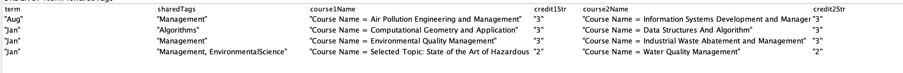
--- 

<b></b>

```
SELECT ?term (GROUP_CONCAT(DISTINCT ?tag; separator=", ") AS ?sharedTags) ?course1Name (STR(?credit1) AS ?credit1Str) ?course2Name (STR(?credit2) AS ?credit2Str)
WHERE {
  ?course1 rdf:type ns:Course .
  ?course1 rdfs:comment ?course1Name .
  ?course1 ns:hasTag ?tag .
  ?course1 ns:term ?term .
  ?course1 ns:credit ?credit1 .
  
  ?course2 rdf:type ns:Course .
  ?course2 rdfs:comment ?course2Name .
  ?course2 ns:hasTag ?tag .
  ?course2 ns:term ?term .
  ?course2 ns:credit ?credit2 .
  
  FILTER (?course1 != ?course2 && ?credit1 = ?credit2)
  FILTER (STR(?course1) < STR(?course2))
}
GROUP BY ?term ?course1 ?course1Name ?credit1 ?course2 ?course2Name ?credit2
HAVING (COUNT(DISTINCT ?tag) >= 1)
ORDER BY ?term ?sharedTags

```


--- 

<b>Maria likes Nont’s idea. However, she has a different requirement where she only wants to compare courses with shared Tags and same credit but also both of the courses are elective. </b>

```

PREFIX rdf: <http://www.w3.org/1999/02/22-rdf-syntax-ns#>
PREFIX rdfs: <http://www.w3.org/2000/01/rdf-schema#>
PREFIX ns: <http://www.semanticweb.org/biraj/ontologies/2024/6/untitled-ontology-33#>

SELECT ?term (GROUP_CONCAT(DISTINCT ?tag; separator=", ") AS ?sharedTags) ?course1Name (STR(?credit1) AS ?credit1Str) ?course2Name (STR(?credit2) AS ?credit2Str) ?type
WHERE {
  ?course1 rdf:type ns:Course .
  ?course1 rdfs:comment ?course1Name .
  ?course1 ns:hasTag ?tag .
  ?course1 ns:term ?term .
  ?course1 ns:credit ?credit1 .

  ?course2 rdf:type ns:Course .
  ?course2 rdfs:comment ?course2Name .
  ?course2 ns:hasTag ?tag .
  ?course2 ns:term ?term .
  ?course2 ns:credit ?credit2 .

  FILTER (?course1 != ?course2 && ?credit1 = ?credit2)
  FILTER (STR(?course1) < STR(?course2))
  
  {
    ?course1 ns:isRequiredCourseOf ?program .
    ?course2 ns:isRequiredCourseOf ?program .
    BIND("Required" AS ?type)
  }
  UNION
  {
    ?course1 ns:isElectiveCourseOf ?program .
    ?course2 ns:isElectiveCourseOf ?program .
    BIND("Elective" AS ?type)
  }
}
GROUP BY ?term ?course1 ?course1Name ?credit1 ?course2 ?course2Name ?credit2 ?type
HAVING (COUNT(DISTINCT ?tag) >= 1)
ORDER BY ?term ?sharedTags

```


---


# Rules for inferred view

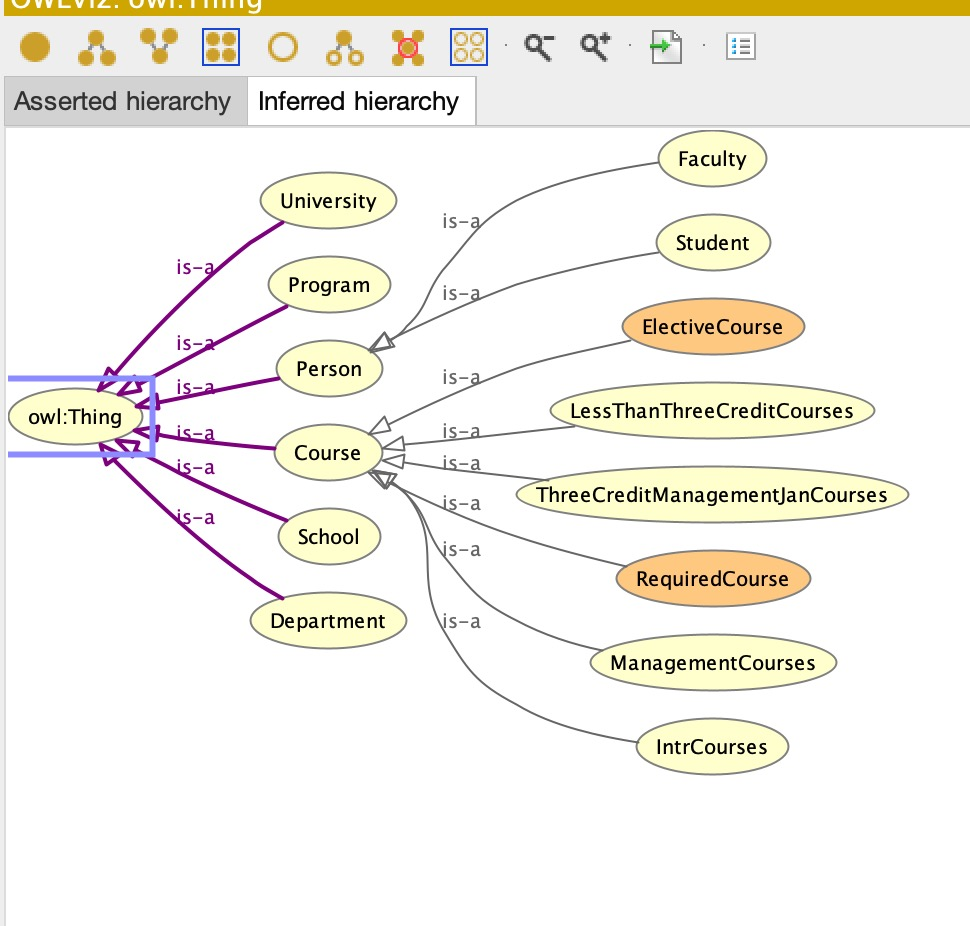

Here, the classes <code>ElectiveCourse</code> and <code>RequiredCourse</code> are inferred from the <code>Course</code> class.</code> We have used class restriction rules to infer them.Please check the <code>ait.rdf</code> file for more details.

The remaining classes are inferred by setting SWRL rules as follows :

1. For <code>ManagementCourses</code> class:
    ```
    untitled-ontology-33:Course(?c) ^ untitled-ontology-33:hasTag(?c, "Management"^^rdf:PlainLiteral) -> untitled-ontology-33:ManagementCourses(?c)
    ```

2. For <code>IntrCourses</code> class:
    ```
    untitled-ontology-33:Course(?c) ^ untitled-ontology-33:term(?c, "INTR"^^rdf:PlainLiteral) -> untitled-ontology-33:IntrCourses(?c) 
    ```

3. For <code>LessThanThreeCreditCourses</code> class:
    ```
    untitled-ontology-33:Course(?c) ^ untitled-ontology-33:credit(?c, ?cr) ^ swrlb:lessThan(?cr, 3) -> untitled-ontology-33:LessThanThreeCreditCourses(?c)
    ```

4. For <code>ThreeCreditManagementJanCourses</code> class:
    ```
    untitled-ontology-33:Course(?c) ^ untitled-ontology-33:hasTag(?c, "Management"^^rdf:PlainLiteral) ^ untitled-ontology-33:term(?c, "Jan"^^rdf:PlainLiteral) ^ untitled-ontology-33:credit(?c, 3) -> untitled-ontology-33:ThreeCreditManagementJanCourses(?c)
    ```

---

## Advantages of Using Protégé over SQL for This Project

1. <b>Complex Relationships</b>

	•	Hierarchical Structures: The project involves hierarchical structures such as Programs, Departments, Schools, and Universities. Ontologies naturally support such structures with properties like isProgramOf, isDepartmentOf. For example:
	•	Program1 isProgramOf Department1
	•	Department1 isDepartmentOf School1
	•	Inference: Using transitive properties, broader relationships can be inferred without explicitly stating them, reducing redundancy and ensuring consistency. For instance, if isProgramOf is marked as transitive, then:
	•	From Program1 isProgramOf Department1 and Department1 isDepartmentOf School1, it can be inferred that Program1 isProgramOf School1.

2. <b>Reasoning Capabilities<></b>


	•	Automated Classification: Reasoners can automatically classify instances based on defined rules and properties. For example:
	•	An instance of Course can be inferred to be an instance of EnvironmentCourses if it has the appropriate hasTag value set to “environment”.
	•	Validation: Reasoners can validate the ontology and ensure that the data adheres to the defined constraints and rules, which is more powerful than traditional SQL constraints. For example:
	•	A reasoner can enforce that each Student has at most one Faculty advisor using the functional property isAdviseeOf.

3. <b>Semantic Queries</b>
	•	Rich Queries: SPARQL, the query language for RDF, allows for querying data based on the semantics captured in the ontology. This is more expressive than SQL for certain types of queries involving hierarchical relationships and inferred knowledge. For example:
	•	Querying for all programs that are part of a university can leverage the transitive property of isProgramOf to include indirect relationships.

4. <b>Interoperability and Data Integration</b>

	•	Linked Data: Ontologies facilitate linking and integrating data from diverse sources, which is particularly useful if the project needs to integrate with external datasets or systems. For example:
	•	Data from different universities can be integrated if they use shared ontological standards, allowing for queries that span multiple institutions.

By leveraging these capabilities, Protégé provides a powerful and flexible platform for managing the complex, hierarchical, and interconnected data involved in this project, offering significant advantages over traditional SQL databases.
